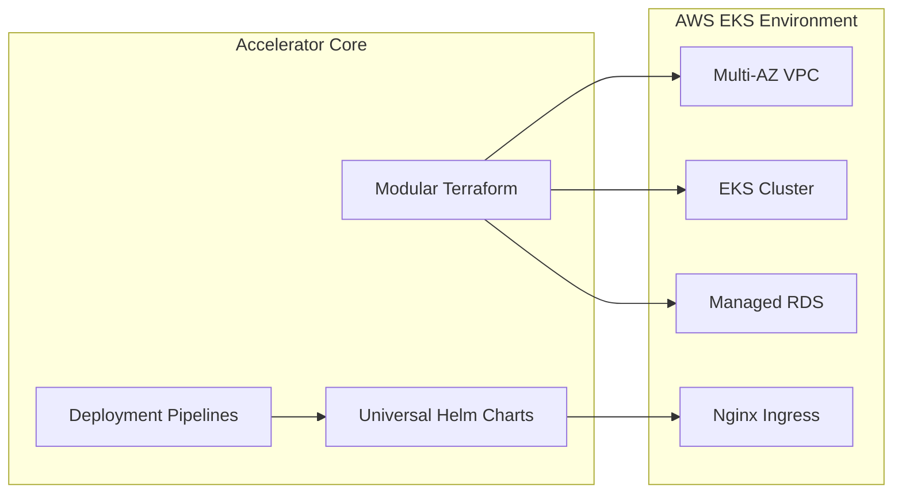
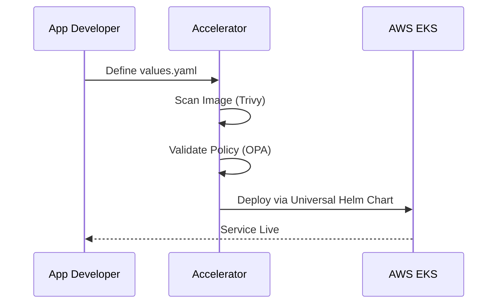

# 🚀 Kubernetes Deployment Accelerator

[](https://www.terraform.io/)
[](https://kubernetes.io/)
[](https://helm.sh/)
[](https://github.com/features/actions)

A reusable Kubernetes deployment framework designed to accelerate application delivery on AWS EKS. This project provides standardized, modular infrastructure and a deployment engine that streamlines application onboarding and promotes cloud-native best practices.

---

## 🔗 Portfolio Repositories Linkage

This project is part of a multi-system engineering showcase:
* **Kubernetes Deployment Accelerator (This Repository)**: Modular Terraform IaC modules, Helm library charts, and policy-driven GitOps pipelines.
  👉 **[Go to Kubernetes Deployment Accelerator](https://github.com/sanjanamahajan2001-sys/k8s-deployment-accelerator)**
* **AI Voice Infrastructure Platform**: The actual Multi-AZ AWS VPC and EKS container cluster provisioned using these templates.
  👉 **[Go to AI Voice Infrastructure Platform](https://github.com/sanjanamahajan2001-sys/AI-Voice-Infrastructure-Platform)**
* **Alcon AI Voice Agent**: The business conversational AI voice engine deployed inside the cluster.
  👉 **[Go to Alcon AI Voice Bot](https://github.com/sanjanamahajan2001-sys/Alcon-AI-voice-agent)**
* **MirrorVault**: Secure database backup, recovery agent, and automatic systemd scheduler.
  👉 **[Go to MirrorVault](https://github.com/sanjanamahajan2001-sys/mirrorvault)**

---

## 🎯 Project Goals

This project was created to explore and demonstrate:
- **Modular IaC design** using reusable Terraform modules.
- **Universal Helm charts** for standardized application deployment.
- **Deployment automation** for reducing application delivery timelines.
- **Security-first CI/CD** with automated container and policy scanning.
- **Infrastructure abstraction** to simplify Kubernetes complexity for developers.

---

## 🏗️ Architecture

The accelerator standardizes the bridge between **Infrastructure as Code** and **Application Deployment**.

### 1. High-Level Architecture


### 2. Deployment Workflow


---

## 🛠️ Validation & Testing

The infrastructure workflows and deployment patterns were validated using:
- **Terraform Plan Validation**: Validated modularity and dependency graphs.
- **Local K8s Testing**: Verified Helm chart templates using `helm install --dry-run`.
- **Policy Enforcement**: Tested OPA rules against sample deployment manifests.
- **CI Pipelines**: Validated GitHub Actions workflows for multi-service deployment.

*Note: The repository is structured for deployment on AWS EKS environments.*

---

## 📊 Example Outputs

### Terraform Module Output
```text
terraform plan
...
Plan: 18 to add, 0 to change, 0 to destroy.
```

### Universal Chart Deployment
```text
helm upgrade --install my-service ./helm-charts/web-app -f values.yaml

Release "my-service" has been upgraded. Happy Helming!
NAME: my-service
NAMESPACE: default
STATUS: deployed
REVISION: 1
```

### CI/CD Security Gate
```text
✓ Trivy Vulnerability Scan: 0 Critical, 0 High
✓ OPA Policy Check: Passed
✓ Helm Linting: Passed
✓ Kubernetes Dry-run: Success
```

---

## 🚀 Future Improvements

- **GitOps Integration**: ArgoCD support for continuous state reconciliation.
- **Cost Analysis**: Integration with Infracost for pre-deployment cost estimation.
- **Multi-Cluster Support**: Scaling modules for global multi-cluster management.
- **Service Mesh**: Optional Istio/Linkerd integration for advanced traffic management.

---

## 📂 Repository Structure

```bash
k8s-deployment-accelerator/
├── terraform-modules/      # Reusable Infrastructure Components
│   ├── vpc/                # Multi-AZ VPC module
│   ├── eks/                # EKS Cluster & Node Groups
│   └── addons/             # Ingress, Cert-Manager, Metrics
├── helm-charts/            # Standardized Application Charts
│   ├── web-app/            # Universal chart for microservices
├── .github/workflows/      # The Accelerator Pipelines
├── examples/               # Demo applications (Go, Node.js)
└── README.md               # Project Documentation
```

---

## 🤝 Contact
Built by **Sanjana Mahajan**.
- **Portfolio**: [personal-portfolio-gold-phi-44.vercel.app](https://personal-portfolio-gold-phi-44.vercel.app)
- **LinkedIn**: [linkedin.com/in/sanjana-mahajan-467982233/](https://www.linkedin.com/in/sanjana-mahajan-467982233/)
- **Email**: [sanjanamaahi2001@gmail.com](mailto:sanjanamaahi2001@gmail.com)
